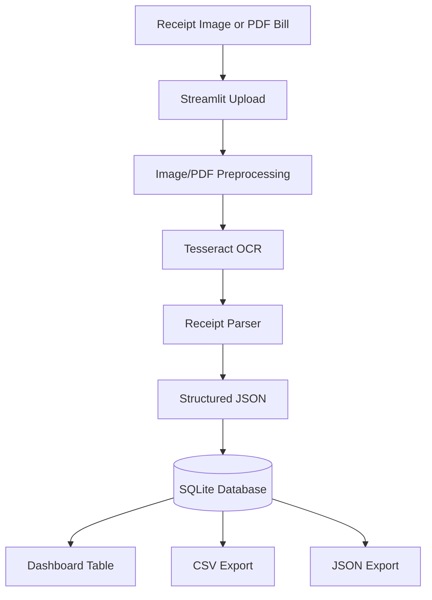

# DocWise AI Project Specification

## Project Title

**DocWise AI** is an offline-first, CPU-compatible, multilingual receipt and bill understanding system that converts unstructured receipt images and PDF bills into structured expense data.

## Problem Statement

Small businesses, students, households, and hackathon teams often collect expenses as paper receipts, screenshots, scanned invoices, and PDF bills. These documents are difficult to search, analyze, or export because their data is locked inside unstructured images or PDFs. Many existing solutions depend on cloud OCR or paid APIs, which creates privacy, cost, and connectivity issues.

DocWise AI solves this by running the complete document-to-expense pipeline locally on a standard CPU machine.

## Motivation

- Preserve privacy by keeping receipts and bills on the user's device.
- Support low-connectivity environments where cloud APIs are unavailable.
- Reduce manual expense entry for day-to-day purchases and invoices.
- Provide a practical hackathon-ready system using accessible open-source tools.
- Make multilingual OCR possible when local Tesseract language packs are installed.

## Objectives

- Read grocery receipts, invoices, and bills from images and PDFs.
- Preprocess images with OpenCV to improve OCR quality.
- Extract text using local Tesseract through `pytesseract`.
- Support English and optional Indian languages through installed Tesseract data.
- Parse OCR text into structured JSON.
- Store parsed expenses locally in SQLite.
- Export reports as CSV and JSON.
- Provide a Streamlit dashboard for upload, processing, review, and export.
- Run offline after installation with CPU-only execution.
- Target Python 3.11 and above.

## Features

| Feature | Description |
| --- | --- |
| Image upload | Accepts receipt and bill images through Streamlit. |
| PDF support | Designed to support PDF text extraction and page rendering through `pdfplumber` and PyMuPDF. |
| OCR preprocessing | Uses grayscale conversion, denoising, and thresholding for better OCR. |
| Local OCR | Uses Tesseract installed on the user's machine. |
| Multilingual OCR | Supports `eng`, `eng+hin`, `eng+tel`, or other installed Tesseract language packs. |
| Receipt parser | Extracts merchant name, date, tax, totals, and item lines. |
| SQLite storage | Saves structured expense records locally. |
| Exports | Produces CSV and JSON files in the `reports/` folder. |
| Offline-first | No cloud APIs or external runtime calls after setup. |

## Functional Requirements

| ID | Requirement | Priority |
| --- | --- | --- |
| FR-01 | Users can upload receipt images in JPG, JPEG, and PNG formats. | High |
| FR-02 | The system preprocesses uploaded images before OCR. | High |
| FR-03 | The system extracts text using local Tesseract OCR. | High |
| FR-04 | Users can configure OCR language codes supported by their local Tesseract installation. | Medium |
| FR-05 | The parser returns structured JSON with merchant, date, total, tax, items, and raw text. | High |
| FR-06 | Parsed receipts are stored in SQLite. | High |
| FR-07 | Users can view stored expenses in the Streamlit dashboard. | High |
| FR-08 | Users can export stored data to CSV. | High |
| FR-09 | Users can export stored data to JSON. | High |
| FR-10 | The pipeline can be tested with sample receipts. | Medium |

## Non-Functional Requirements

| Category | Requirement |
| --- | --- |
| Offline operation | The app must not require cloud APIs after dependencies and Tesseract data are installed. |
| CPU compatibility | The system must run on CPU-only machines. |
| Privacy | Uploaded files, OCR text, parsed data, and exports remain local. |
| Maintainability | Code should follow PEP 8 and include useful docstrings. |
| Portability | The app should run on macOS, Linux, and Windows with Python 3.11+. |
| Reliability | Parser failures should preserve raw OCR text for manual review. |
| Extensibility | OCR, parsing, persistence, and export logic should remain modular. |

## Architecture Diagram



## Folder Structure

```text
docwise/
├── app.py
├── image_processing.py
├── ocr.py
├── parser.py
├── database.py
├── export.py
├── test_pipeline.py
├── requirements.txt
├── README.md
├── speckit.md
├── sample_receipts/
├── uploads/
├── reports/
└── assets/
```

## Module Descriptions

| Module | Responsibility |
| --- | --- |
| `app.py` | Streamlit user interface for upload, OCR processing, result display, and export actions. |
| `image_processing.py` | OpenCV preprocessing utilities for image cleanup before OCR. |
| `ocr.py` | Tesseract OCR wrapper functions for image text extraction. |
| `parser.py` | Rule-based parser that converts OCR text into structured receipt dictionaries. |
| `database.py` | SQLite connection, schema initialization, save, and list operations. |
| `export.py` | CSV and JSON export utilities for stored receipt records. |
| `test_pipeline.py` | Smoke tests for parser and pipeline behavior. |
| `sample_receipts/` | Local test images for development and demonstrations. |
| `uploads/` | Runtime folder for uploaded documents. |
| `reports/` | Runtime folder for exported CSV and JSON reports. |
| `assets/` | Optional images, icons, or presentation assets. |

## Backend Workflow

1. User uploads a receipt image or bill.
2. The file is saved locally in `uploads/`.
3. Image preprocessing improves contrast and reduces noise.
4. Tesseract extracts text from the processed document.
5. The parser identifies merchant, date, tax, total, and line items.
6. Parsed data is saved as structured records in SQLite.
7. The dashboard reads records from SQLite.
8. Users export records to CSV or JSON in `reports/`.

## Frontend Workflow

1. Open the Streamlit app.
2. Select local Tesseract language codes, such as `eng` or `eng+hin`.
3. Upload a receipt image.
4. Click the process button.
5. Review parsed JSON and saved expense records.
6. Export the current database view to CSV or JSON.

## API and Function Contracts

### `image_processing.preprocess_image(image_path)`

| Field | Details |
| --- | --- |
| Input | `image_path: str` |
| Output | OpenCV image array after thresholding |
| Errors | Raises `FileNotFoundError` when the image cannot be read |

### `ocr.extract_text_from_image(image_path, languages="eng")`

| Field | Details |
| --- | --- |
| Input | Image path and Tesseract language string |
| Output | OCR text as `str` |
| Notes | Language packs must be installed locally through Tesseract |

### `parser.parse_receipt_text(text)`

| Field | Details |
| --- | --- |
| Input | Raw OCR text |
| Output | Receipt dictionary with `merchant_name`, `date`, `total`, `gst`, `items`, and `raw_text` |
| Strategy | Uses regular expressions and line-based heuristics |

### `database.save_receipt(receipt, db_path="docwise.db")`

| Field | Details |
| --- | --- |
| Input | Parsed receipt dictionary |
| Output | SQLite row id |
| Side effect | Creates database and `receipts` table if needed |

### `export.export_receipts_to_csv(receipts, output_path)`

| Field | Details |
| --- | --- |
| Input | List of receipt dictionaries and output path |
| Output | Output path |
| Side effect | Writes a CSV report |

## OCR Pipeline

```text
Input Image
→ OpenCV read
→ Grayscale conversion
→ Gaussian blur
→ Otsu thresholding
→ Tesseract OCR
→ Raw text
```

Recommended Tesseract language examples:

```text
eng
eng+hin
eng+tel
eng+tam
eng+kan
eng+mal
```

The exact language codes depend on installed Tesseract trained data.

## Parser Workflow

```text
Raw OCR Text
→ Split into non-empty lines
→ First line used as merchant candidate
→ Regex date detection
→ GST/CGST/SGST/IGST amount detection
→ Total/net amount detection
→ Item line detection
→ Structured dictionary
```

The parser is intentionally rule-based for offline reliability. Future versions can add vendor-specific templates and stronger table extraction.

## Database Schema

```sql
CREATE TABLE IF NOT EXISTS receipts (
    id INTEGER PRIMARY KEY AUTOINCREMENT,
    merchant_name TEXT,
    receipt_date TEXT,
    total REAL,
    gst REAL,
    items_json TEXT NOT NULL,
    raw_text TEXT,
    created_at TEXT DEFAULT CURRENT_TIMESTAMP
);
```

## Sample JSON Output

```json
{
  "merchant_name": "DMart",
  "date": "2026-06-28",
  "total": 450.0,
  "gst": 18.5,
  "items": [
    {
      "name": "Milk",
      "amount": 60.0
    },
    {
      "name": "Rice",
      "amount": 240.0
    },
    {
      "name": "Soap",
      "amount": 150.0
    }
  ],
  "raw_text": "DMart\nDate: 28-06-2026\nMilk 60.00\nRice 240.00\nSoap 150.00\nGST 18.50\nTotal 450.00"
}
```

## Installation Guide

### 1. Install Python

Use Python 3.11 or later.

```bash
python3 --version
```

### 2. Install Tesseract

macOS:

```bash
brew install tesseract
brew install tesseract-lang
```

Ubuntu/Debian:

```bash
sudo apt-get install tesseract-ocr
sudo apt-get install tesseract-ocr-hin tesseract-ocr-tel tesseract-ocr-tam
```

Windows:

Install Tesseract from the official installer and add it to `PATH`.

### 3. Create a Virtual Environment

```bash
python3 -m venv venv
source venv/bin/activate
```

On Windows:

```bash
venv\Scripts\activate
```

### 4. Install Python Dependencies

```bash
pip install -r requirements.txt
```

## Running Instructions

Start the Streamlit app:

```bash
streamlit run app.py
```

Run parser tests:

```bash
pytest
```

Run OCR folder script:

```bash
python ocr.py
```

## Testing Strategy

| Test Area | Approach |
| --- | --- |
| Image preprocessing | Validate that sample images produce readable thresholded output. |
| OCR | Test English and installed Indian language packs with known sample receipts. |
| Parser | Use fixture strings for dates, totals, GST lines, and item lines. |
| Database | Verify table creation, insert operations, and list retrieval. |
| Export | Confirm CSV and JSON reports are created with expected fields. |
| End-to-end | Run upload-to-export flow through Streamlit using sample receipts. |

## Future Enhancements

- Add PDF-to-image conversion with PyMuPDF for scanned PDF bills.
- Add direct PDF text extraction with `pdfplumber` when embedded text is available.
- Add vendor-specific parsing templates for common stores.
- Add confidence scores and manual correction UI.
- Add duplicate receipt detection.
- Add category prediction for grocery, travel, food, utilities, and medical expenses.
- Add monthly charts and budget summaries.
- Add multilingual parser rules for Indian receipt terms.
- Package the app as a local desktop executable.

## Team Member Responsibilities

| Role | Responsibility |
| --- | --- |
| Backend engineer | OCR pipeline, parser, SQLite schema, export utilities. |
| Frontend engineer | Streamlit dashboard, upload flow, data table, export controls. |
| Data/testing engineer | Sample receipts, parser fixtures, OCR quality checks, demo data. |
| Documentation lead | README, `speckit.md`, setup instructions, presentation notes. |
| Presenter | Hackathon demo narrative, problem framing, and result walkthrough. |

## Hackathon Presentation Summary

DocWise AI is a privacy-friendly expense extraction tool that turns receipt images and bills into structured data without cloud APIs. The demo shows a receipt upload, local OCR, JSON extraction, SQLite storage, and one-click CSV/JSON export. The key differentiator is offline-first operation on CPU-only systems with optional multilingual OCR through locally installed Tesseract language packs.

## Risks and Limitations

| Risk | Impact | Mitigation |
| --- | --- | --- |
| Low-quality images | OCR may miss text or produce noisy output. | Improve preprocessing and guide users to upload clear images. |
| Receipt layout variation | Rule-based parser may miss fields. | Add vendor templates and manual correction. |
| Tesseract language data missing | Multilingual OCR may fail. | Document language pack installation clearly. |
| Handwritten receipts | OCR accuracy may be poor. | Scope initial version to printed receipts and bills. |
| PDF complexity | Scanned PDFs and embedded-text PDFs require different paths. | Use both PyMuPDF rendering and `pdfplumber` extraction. |
| Currency/date ambiguity | Parser may misread formats. | Store raw text and allow review/correction. |
